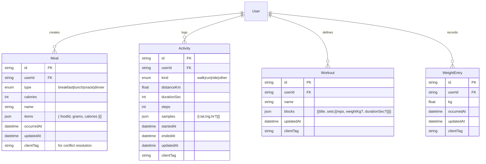

# Fitness Tracker PWA – Feature & Implementation Spec

Target: Android smartphones • Stack: React, Vite, Tailwind CSS, VitePWA (Workbox), OpenAuth, self‑hosted backend • Mode: Offline‑first

---

## 1) System Overview

A mobile‑first, offline‑first fitness tracker PWA with five primary screens: **Dashboard, Meals, Activity Tracking, Workout, Settings**. Data persists locally, syncs to a self‑hosted backend using conflict‑aware replication. Auth via **OpenAuth**. Service worker handles caching, offline fallbacks, background sync, and push notifications.

### Key Non‑Functional Requirements

* **Offline‑first**: All reads/writes work without network; queued sync when online.
* **Performance**: <2.5s FCP on mid‑range Android; <100KB JS on first load (code‑split route bundles).
* **Security**: TLS, token storage in IndexedDB; no PII in SW logs.
* **Accessibility**: WCAG 2.1 AA, keyboard and screen reader friendly.
* **Observability**: Minimal client telemetry (web‑vitals) with offline queueing.

---

## 2) High‑Level Architecture

* **UI**: React + React Router, Tailwind for styling, Headless UI/shadcn optional.
* **State**: React Query (TanStack Query) for server cache + custom offline queue; lightweight Zustand slice for UI state.
* **Local Storage**: IndexedDB via Dexie (or idb) with versioned schema; write‑behind queue.
* **Sync**: Background Sync (service worker) for queued mutations; pull on focus/interval.
* **Auth**: OpenAuth (self‑hosted). PKCE flow. Refresh with silent token endpoint; tokens kept in memory + IndexedDB fallback encrypted.
* **PWA**: VitePWA plugin; Workbox runtime caching strategies; push notifications (optional in later work package).
* **Backend**: Node (Express/Fastify) + PostgreSQL (Prisma) with REST or tRPC; endpoints versioned `/v1`.

### Data Model (initial)

### Conflict Resolution

* Every write includes `updatedAt` and `clientTag` (UUID v4). Server resolves by **last‑write‑wins** on `updatedAt` with tie‑break on `clientTag`. Server returns canonical record + `syncStamp`.

---

## 3) Navigation & Screens

### Global Navigation

* **Bottom tab bar** for the 5 screens.
* **App shell** cached via SW for instant route transitions.

### Dashboard (initially empty)

* Placeholder: weight trend area (2 months), daily calories card (remaining vs goal), **Add Meal** floating button.
* Later: configurable widgets registry.

### Meals

* Add/manage meals (type, items), calorie totals, simple food library (local JSON now; later online db).

### Activity Tracking

* Start/stop/pause an activity; request Geolocation + Permissions; collect samples (time, distance).

### Workout

* Define workouts (blocks, sets/reps); start workout session => logs as Activity.

### Settings

* Profile (name, height, baseline kcal goal), units, privacy, data export.

---

## 4) Offline & Caching Strategy (Workbox)

* **Precaching**: app shell, route skeletons, icons, manifest.
* **Runtime caching**:

  * `/api/**` GET → **StaleWhileRevalidate** with cache bust on `ETag`.
  * POST/PUT/DELETE queued via **background sync**; replay with exponential backoff.
  * Images/avatars → **CacheFirst** with max‑age + quota.
* **Fallbacks**: Offline fallback route `/offline` and generic fallback page for images.

---

## 5) Security & Auth

* OpenAuth PKCE login screen → redirect flow → receive code → token. Store **access** token in memory; **refresh** token encrypted in IndexedDB via WebCrypto.
* Attach `Authorization: Bearer` to fetch via React Query `fetcher`.
* Logout clears SW caches for user scope.

---

## 6) Testing Strategy

* **Unit**: Vitest + React Testing Library; Dexie tests with fake IndexedDB.
* **Integration**: MSW to mock backend; auth mocked provider.
* **E2E**: Playwright baseline (later).
* **SW**: Workbox test harness + unit tests for queue/serialization logic.

---

## 7) Work Packages (tickets)

Each package lists: *Business logic*, *Implementation notes*, *Unit tests & acceptance*.

### WP0 – Project Bootstrap (Scaffold & Tooling)

**Business logic**: None (infra only).
**Implementation**:

* Vite + React + TypeScript; Tailwind; ESLint/Prettier; Husky + lint‑staged.
* VitePWA (injectManifest) with Workbox; manifest.json; icons.
* React Router v6, file‑based routes (optional vite‑plugin‑pages).
  **Tests**: Vitest setup; RTL helpers; sample test for App shell renders.
  **Acceptance**: App loads offline after 2nd visit; `npm run test` passes.

### WP1 – Auth (OpenAuth) + Protected Routes

**Business logic**: User can log in/out; unauthenticated users see login only.
**Implementation**:

* OpenAuth PKCE flow; `/login`, `/callback` routes; token manager.
* ProtectedRoute wrapper; store tokens (mem + IndexedDB encrypted).
  **Tests**:
* Mock OpenAuth; verify redirect on protected route.
* Token storage round‑trip and refresh.
  **Acceptance**: After login, user reaches Dashboard; reload keeps session.

### WP2 – App Shell & Navigation

**Business logic**: Bottom tabs for 5 screens; persistent layout.
**Implementation**:

* `<AppShell>` with bottom nav; route components for screens.
* Skeleton Dashboard with empty cards and Add Meal FAB.
  **Tests**:
* Route navigation tests; a11y landmarks.
  **Acceptance**: Tabs switch without full reload; works offline.

### WP3 – Local DB (IndexedDB) & Sync Queue

**Business logic**: All create/update/delete work offline; queued for sync.
**Implementation**:

* Dexie schemas for Meal, Activity, Workout, WeightEntry, Mutations queue.
* Queue serializer; background sync registration; replay worker.
  **Tests**:
* Queue persistence across reloads; failure retry/backoff.
  **Acceptance**: Create meal offline → visible immediately → syncs when online.

### WP4 – Meals CRUD

**Business logic**: Add/edit/delete meals; total daily calories; meal types.
**Implementation**:

* Forms with Zod validation; calories auto‑sum from items.
* React Query mutations write‑through to Dexie + queue.
  **Tests**:
* Form validation; optimistic update; conflict overwrite by `updatedAt`.
  **Acceptance**: Day total updates instantly; survives offline/online flips.

### WP5 – Weight Tracking

**Business logic**: Add weight entries; show 2‑month line trend on Dashboard.
**Implementation**:

* Lightweight chart (Recharts) with offline data; selector for date range.
* Store entries locally; sync like others.
  **Tests**:
* Unit for trend selector; render snapshot for empty vs populated.
  **Acceptance**: Chart appears with mock data; accessible SVG.

### WP6 – Activity Tracking (basic)

**Business logic**: Start/pause/stop walk; duration + distance; save as Activity.
**Implementation**:

* Geolocation + watchPosition; Haversine for distance; foreground only.
* App keeps sampling even when tab hidden (Page Visibility + wake lock fallback if available).
  **Tests**:
* Distance calc unit tests; reducer for session state.
  **Acceptance**: Simulated path accumulates distance; saved offline.

### WP7 – Workouts (definitions → activity)

**Business logic**: CRUD workouts; start a workout, log sets/reps; save as Activity.
**Implementation**:

* Workout builder UI; session runner with next/set timers.
* Convert completed workout to Activity record.
  **Tests**:
* Builder validation; conversion function unit tests.
  **Acceptance**: A created workout can be run and saved offline.

### WP8 – Dashboard Widgets (calories/remaining + config store)

**Business logic**: Show calories remaining vs daily goal; allow goal setting (Settings).
**Implementation**:

* Selector `dailyCaloriesRemaining(date)`; widget registry; reorder later.
  **Tests**:
* Selector unit tests (edge cases: no meals, multiple meals).
  **Acceptance**: Card updates live as meals change.

### WP9 – Settings & Profile

**Business logic**: Update profile, units, daily calorie goal.
**Implementation**:

* Simple form; local store + sync.
  **Tests**:
* Input validation; persistence.
  **Acceptance**: Dashboard reflects updated goal.

### WP10 – Sync Engine (server integration)

**Business logic**: Reconcile changes with backend; resolve conflicts.
**Implementation**:

* `/v1/{meals,activities,workouts,weights}` GET delta via `If-None-Match`/`since`.
* Mutation replay with LWW resolution; clock skew tolerance.
  **Tests**:
* MSW server with conflict scenarios; idempotency tests.
  **Acceptance**: Two devices converge to same state.

### WP11 – PWA Polish (install, offline page, icons)

**Business logic**: Install prompt; offline friendly UX.
**Implementation**:

* Custom `beforeinstallprompt` flow; `/offline` route; icon set.
  **Tests**:
* SW precache manifest contains app shell; offline nav test (Playwright later).
  **Acceptance**: App installs on Android; 2nd load works in airplane mode.

---

## 8) API Sketch (server)

* `POST /v1/auth/token` (OpenAuth server side)
* `GET /v1/meals?since=timestamp` → `{ items, syncStamp }`
* `POST /v1/meals` `{...}`
* `PUT /v1/meals/:id` `{...}`
* Similar for activities, workouts, weights
* ETags or `syncStamp` on list endpoints; 429/503 backoff headers.

---

## 9) Coding Conventions

* TypeScript strict; Zod for runtime validation; date handling via Day.js.
* UI: Tailwind utility classes, dark mode with `class` strategy.
* Error boundaries per route; toast notifications for failures.

---

## 10) Prompts & Acceptance

* Each WP contains acceptance criteria to guide PR review; include unit tests with >80% lines for domain selectors and reducers.

---

# Codex Coding Agent Prompt – Create App Skeleton (Empty Dashboard)

**Goal**: Scaffold a React + Vite + Tailwind + VitePWA app with OpenAuth login and five routed screens. Implement an **empty Dashboard** with placeholder cards and an **Add Meal** button. Configure offline support with Workbox via VitePWA. No business logic beyond routing and shells.

**Do exactly the following:**

1. **Create project**

* Initialize Vite React + TypeScript project named `fittrack-pwa`.
* Install deps:

  * runtime: `react-router-dom`, `@tanstack/react-query`, `dexie`, `idb-keyval`, `dayjs`
  * styling: `tailwindcss`, `postcss`, `autoprefixer`
  * pwa: `vite-plugin-pwa`
  * auth: `openauth-js` (placeholder, per [https://openauth.js.org/docs/](https://openauth.js.org/docs/))
  * testing: `vitest`, `@testing-library/react`, `@testing-library/jest-dom`, `msw`, `fake-indexeddb`, `@testing-library/user-event`
  * tooling: `eslint`, `prettier`, `husky`, `lint-staged`

2. **Configure Tailwind**

* Generate config; enable JIT; set content to `index.html`, `src/**/*.{ts,tsx}`; add base styles in `src/index.css` (include Tailwind directives).

3. **PWA setup (Workbox via VitePWA)**

* Add `vite.config.ts` with VitePWA using `injectManifest` and a `src/sw.ts` service worker file.
* PWA manifest: name `FitTrack`, short\_name `FitTrack`, theme\_color `#0ea5e9`, icons (placeholder square PNG 192/512), display `standalone`, orientation `portrait`.
* In `sw.ts`, implement: precache manifest injection, offline fallback route `/offline`, and default Workbox handlers (CacheFirst for assets, StaleWhileRevalidate for HTML/JS).

4. **Routing & App Shell**

* Install React Router; create routes: `/` (Dashboard), `/meals`, `/activity`, `/workout`, `/settings`, `/login`, `/callback`, `/offline`.
* Create `<AppShell>` with bottom tab nav linking to the 5 screens; highlight active tab.
* Protect the 5 primary routes behind a simple `RequireAuth` component that checks a mocked `useAuth()` hook (to be implemented later with OpenAuth).

5. **Auth placeholders**

* Implement `AuthProvider` with context returning `isAuthenticated`, `login()`, `logout()`; in `login()`, redirect to `/callback` in dev.
* `/login` page with a button that calls `login()`.
* `/callback` page simulates token reception and sets `isAuthenticated=true`.

6. **Dashboard (empty)**

* Create `Dashboard` with two empty cards using Tailwind: (a) "Weight Trend (Last 2 Months)" placeholder box, (b) "Calories Remaining Today" placeholder metric.
* Add floating action button (bottom‑right) labeled **Add Meal** → navigates to `/meals/new` (page can be a placeholder route for now).

7. **Pages**

* Create minimal pages for Meals, Activity, Workout, Settings with headers and placeholder content.

8. **Styling**

* Mobile‑first layout; safe‑area insets; dark mode class on `<html>`.

9. **Testing**

* Add a test: renders App, redirects to `/login` when not authed.
* After mock login, assert tabs render and Dashboard placeholders are visible.

10. **Scripts & Lint**

* `npm run dev`, `build`, `preview`, `test`, `lint`, `format`.
* Husky pre‑commit runs lint & test.

11. **README**

* Document setup, dev, build, PWA testing notes (how to view in offline after first load in dev with `vite-plugin-pwa` options).

**Deliverables**

* Complete repo with files:

  * `index.html`, `src/main.tsx`, `src/App.tsx`, `src/AppShell.tsx`, `src/routes/*.tsx`
  * `src/providers/AuthProvider.tsx`, `src/hooks/useAuth.ts`
  * `src/sw.ts`, `vite.config.ts`, `public/manifest.webmanifest`, icons placeholders
  * `src/index.css`, Tailwind configs
  * tests under `src/__tests__/` for routing/auth placeholder
  * tooling configs: ESLint, Prettier, tsconfig, Vitest

**Acceptance**

* App builds and runs; unauthenticated user sees Login; after mock login, sees bottom nav with 5 tabs and an **empty Dashboard** with two placeholder cards and an **Add Meal** FAB. PWA installs and loads offline on second visit.
